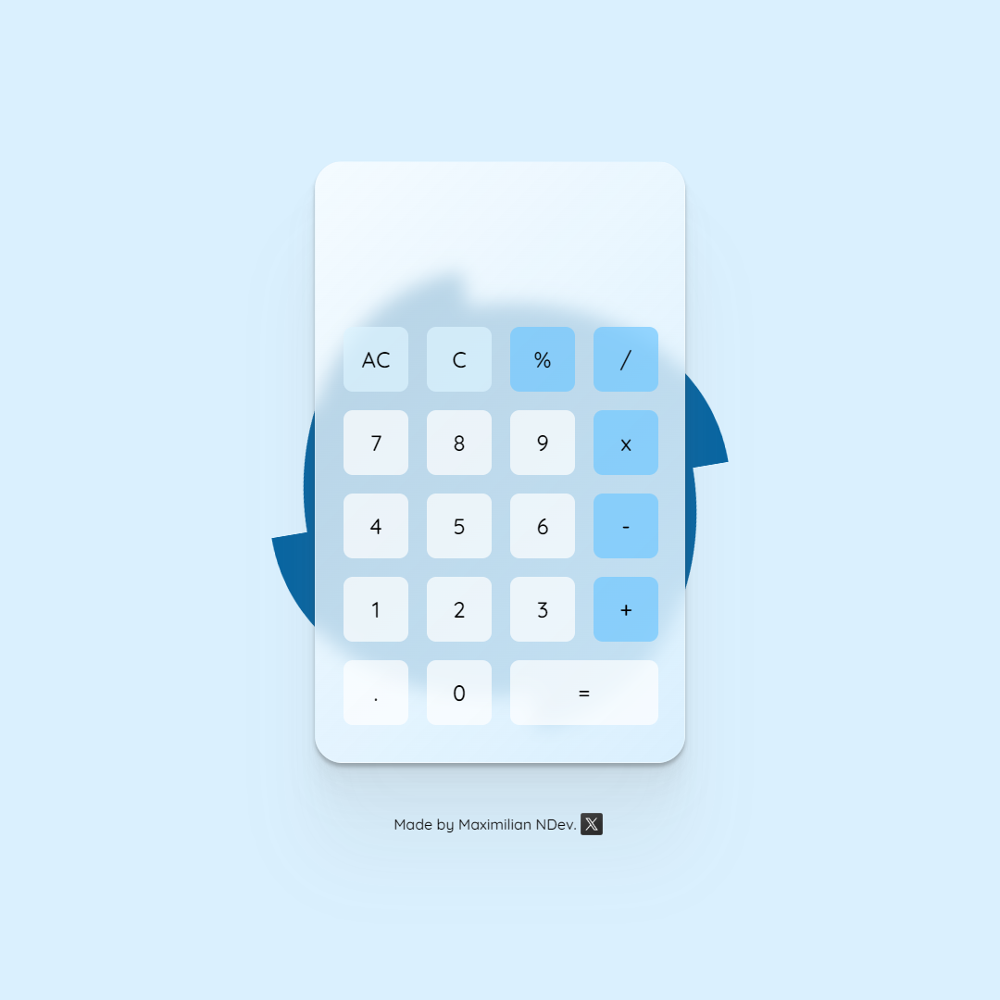

# Odin-Calculator

[Live link is here.](https://x6nenko.github.io/Odin-Calculator/)

## Project tasks.
- [x] Create functions for all of the basic math operators (add, subtract, multiply, divide).
- [x] A calculator operation will consist of a number, an operator, and another number.
- [x] Create operate function that takes an operator and 2 numbers and then calls one of the above functions on the numbers.
- [x] Create the functions that populate the display when you click the number buttons.
- [x] Use operate() when the user presses the “=” key. Update the display with the ‘solution’ to the operation.
- [x] Users should be able to string together several operations and get the right answer.
- [x] Your calculator should not evaluate more than a single pair of numbers at a time.
- [x] You should round answers with long decimals so that they don’t overflow the screen.
- [x] Pressing = before entering all of the numbers or an operator could cause problems!
- [x] Pressing “clear” should wipe out any existing data.

### Extra project tasks:
- [x] Add a . button and let users input decimals! Make sure you don’t let them type more than one though.
- [x] Make it look nice!
- [x] Add a “backspace” button, so the user can undo if they click the wrong number.
- [x] Add keyboard support!

## Extra features. They are not required by a project. That's my list of optional ideas and tasks to make it better.

### Extra features that were implemented:
- [x] Add a "percentage" button with appropriate functionality.

### Extra features and tasks to implement:
- [ ] Refactor the code. Make it more clean. DRY.

## What I've learned.
Importance of writing clean code and refactoring the code on the go. The more spaghetti there is, the harder it is to manage the code.